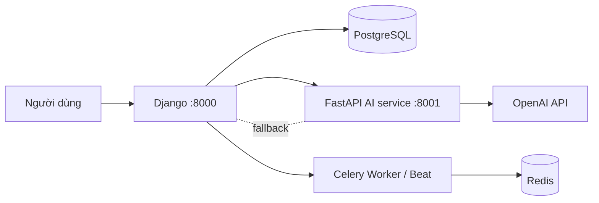

# StudyFlow

> Web app lập kế hoạch học tập cá nhân: quản lý môn học & deadline, **tự sắp lịch học vào khung giờ trống**, Pomodoro và AI cảnh báo rủi ro trễ deadline.

## Tính năng hiện có

| Nhóm | Chức năng |
|---|---|
| **Tài khoản** | Đăng ký / đăng nhập / đăng xuất, hồ sơ cá nhân (email, múi giờ, mục tiêu giờ học/ngày), quản trị qua `/admin/` |
| **Môn học** | CRUD môn học, mã môn, màu nhãn, tín chỉ, giảng viên, học kỳ |
| **Công việc** | CRUD task, gắn mức ưu tiên (1–4), độ khó (1–3), ước tính thời lượng (phút), deadline, trạng thái TODO / IN_PROGRESS / COMPLETED, đánh dấu hoàn thành |
| **Lập lịch tự động** | Sắp task vào khung giờ trống bằng thuật toán greedy (xem bên dưới), lưu thành `ScheduleBlock` |
| **Lịch dạng calendar** | Xem lịch theo tuần, kéo–thả chỉnh sửa block qua API, **khóa (lock)** block đã sửa tay để thuật toán không ghi đè |
| **Pomodoro** | Timer Pomodoro trên trình duyệt, ghi lại phiên làm việc (WORK / SHORT_BREAK / LONG_BREAK) |
| **AI hỗ trợ** | Phân tích rủi ro trễ deadline (`/ai/`), tóm tắt việc trong ngày — gọi FastAPI service, tự fallback về luật nếu AI service tắt |
| **Dashboard** | Tổng quan: môn học, task sắp tới, thời gian học, tiến độ |

Chưa có: quên mật khẩu, phân quyền ngoài admin, email/push nhắc việc, biểu đồ, deploy online.

## Công nghệ

| Thành phần | Công nghệ |
|---|---|
| Backend + giao diện | Django 5 (server-rendered, template + Tailwind CDN) |
| AI microservice | FastAPI (port 8001) + OpenAI `gpt-3.5-turbo`, có fallback rule-based |
| Cơ sở dữ liệu | **SQLite** khi dev local (mặc định) · **PostgreSQL** khi set `USE_SQLITE=False` + `DATABASE_URL` (Docker dùng Postgres 16) |
| Task nền | Redis + Celery + `django-celery-beat` (đã cấu hình trong compose) |
| Cấu hình | `python-dotenv` (file `.env`, không commit) |
| Triển khai | Docker Compose (web, ai_service, db, redis, celery_worker, celery_beat) |

## Kiến trúc



## Cấu trúc thư mục

```
studyflow/          # Cấu hình Django (settings, urls, celery)
apps/
  accounts/         # User model, đăng ký/đăng nhập, hồ sơ
  courses/          # Môn học
  tasks/            # Công việc & deadline
  scheduler/        # Lịch + thuật toán lập lịch (engine/optimizer.py)
  pomodoro/         # Timer & ghi nhận phiên học
  calendar_sync/    # Google Calendar OAuth thật (google-auth-oauthlib) — phần sync sự kiện chưa làm
  ai_assistant/     # Gọi AI service, lưu AIInsight
  dashboard/        # Trang tổng quan
ai_service/         # FastAPI microservice (analyze-risks, daily-summary)
templates/          # Giao diện
static/             # CSS/JS (hiện chưa được template tham chiếu)
docker/             # Dockerfile.django, Dockerfile.fastapi
docker-compose.yml
```

## Cài đặt & Chạy dự án

### Cách 1 — Docker (khuyên dùng)

```bash
docker compose up --build
docker compose exec web python manage.py migrate
docker compose exec web python manage.py createsuperuser
```

> Migration đã có sẵn trong repo cho cả 8 app → không cần chạy `makemigrations` khi cài mới.
> Nếu bạn sửa model, chạy `makemigrations` và **ghi rõ tên app** (vd: `python manage.py makemigrations tasks`):
> lệnh không tham số chỉ xét các app đã có thư mục `migrations/`, app chưa có thư mục sẽ im lặng / báo "No changes detected".

- Web: http://localhost:8000 · Admin: http://localhost:8000/admin/
- AI service: http://localhost:8001/docs · health: http://localhost:8001/health
- Postgres `localhost:5432`, Redis `localhost:6379`

### Cách 2 — Chạy local (không Docker)

```bash
python -m venv .venv
.venv\Scripts\activate          # PowerShell (Linux/macOS: source .venv/bin/activate)
pip install -r requirements.txt

# Tạo file .env (xem bảng biến môi trường bên dưới). Muốn chạy nhanh bằng SQLite:
#   USE_SQLITE=True

python manage.py migrate
python manage.py createsuperuser
python manage.py runserver      # http://localhost:8000

# Static files: settings bật WHITENOISE_USE_FINDERS nên CSS/Tailwind JS
# vẫn serve được cả khi DEBUG=False. Production vẫn nên chạy collectstatic:
#   python manage.py collectstatic

# AI service (tùy chọn — nếu tắt, Django tự phân tích bằng luật heuristic)
pip install -r ai_service/requirements.txt
uvicorn ai_service.main:app --host 127.0.0.1 --port 8001
```

> Migration đã có sẵn trong repo cho cả 8 app. Chỉ chạy `makemigrations` khi thay đổi model, và phải ghi rõ tên app
> (vd: `python manage.py makemigrations tasks`) — lệnh không tham số sẽ báo "No changes detected" với app chưa có thư mục `migrations/`.

## Biến môi trường (`.env`)

| Biến | Mô tả | Mặc định |
|---|---|---|
| `SECRET_KEY` | Khóa bí mật Django. `DEBUG=False` **bắt buộc** dùng giá trị mạnh (không còn là `django-insecure-...`) nếu không Django raise `ImproperlyConfigured` | giá trị dev (insecure) |
| `DEBUG` | Chế độ debug — dev đặt `True` trong `.env` | `False` |
| `ALLOWED_HOSTS` | Danh sách host, cách nhau bởi dấu phẩy | `localhost,127.0.0.1` |
| `USE_SQLITE` | `True` = SQLite, `False` = PostgreSQL | `True` |
| `DATABASE_URL` | Chuỗi kết nối Postgres (bắt buộc khi `USE_SQLITE=False`) | local Postgres |
| `REDIS_URL`, `CELERY_BROKER_URL`, `CELERY_RESULT_BACKEND` | Redis / Celery | `redis://localhost:6379/0` |
| `AI_SERVICE_URL` | URL FastAPI AI service | `http://localhost:8001` |
| `OPENAI_API_KEY` | Kích hoạt AI phân tích (để trống = dùng fallback) | rỗng |
| `GOOGLE_CLIENT_ID`, `GOOGLE_CLIENT_SECRET`, `GOOGLE_REDIRECT_URI` | OAuth2 Google Calendar | rỗng |

`.env` nằm trong `.gitignore` — **không commit**, chỉ commit `.env.example` làm mẫu.

## API của AI service (FastAPI)

| Method | Endpoint | Mô tả |
|---|---|---|
| `GET` | `/health` | Kiểm tra service |
| `POST` | `/api/v1/analyze-risks` | Phân tích rủi ro trễ deadline → `{title, summary, risk_level, advice}` |
| `POST` | `/api/v1/daily-summary` | Tóm tắt việc trong ngày → `{headline, summary_text, key_priorities, encouragement}` |

Django gọi `analyze-risks` với 15 task gần nhất (`apps/ai_assistant/services.py`), kết quả lưu vào `AIInsight`. Không có API key → service trả kết quả theo luật (rule-based).

## Route chính của Django

| Đường dẫn | Chức năng |
|---|---|
| `/` | Dashboard |
| `/accounts/register/`, `/accounts/login/`, `/accounts/profile/` | Tài khoản |
| `/courses/`, `/tasks/` | CRUD môn học, task |
| `/scheduler/` | Calendar + `POST /scheduler/auto-schedule/` (chạy thuật toán), API block |
| `/pomodoro/` | Timer + `POST /pomodoro/api/record/` |
| `/ai/` | Cảnh báo deadline, tóm tắt việc |
| `/calendar/connect/`, `/calendar/oauth2callback/` | Google OAuth |
| `/admin/` | Quản trị |

## Thuật toán lập lịch (`apps/scheduler/engine/optimizer.py`)

`ScheduleOptimizer` chạy greedy, không dùng solver:

1. Xóa các block **tự sinh trước đó** chưa bị khóa (block đã sửa tay được giữ nguyên).
2. Lấy task chưa lên lịch, sắp theo **deadline tăng dần → ưu tiên giảm dần**.
3. Với mỗi ngày (08:00–22:00, hôm nay bắt đầu từ `now + 15 phút`), lấy khung trống sau khi trừ đi các block đã khóa.
4. Đặt từng task vào khung trống: phiên tối đa **120 phút**, nghỉ **15 phút** liên tiếp, không trôi qua deadline; khung < 30 phút thì bỏ qua.
5. Task được chia đủ thời lượng → đánh dấu `is_scheduled=True`.

Người dùng kéo–thả trên calendar sẽ gọi `api/block/<pk>/update/` và block tự chuyển sang trạng thái khóa.

## Việc cần làm tiếp

- [x] Sửa URL `calendar_sync:sync` chưa tồn tại → dùng `calendar_sync:connect`.
- [x] Tạo migration cho 8 app + unit test (`python manage.py test`).
- [ ] Google Calendar: luồng OAuth thật (`google-auth-oauthlib`, state + token thật) đã làm; **phần còn lại**: đồng bộ sự kiện (đọc/ghi event Google Calendar) chưa viết — chưa có hàm sync nào, token mới chỉ được lưu.
- [ ] Thêm Celery task: nhắc việc qua email, nhắc deadline (hiện worker/beat chạy nhưng không có task).
- [ ] Gọi endpoint `daily-summary` từ Django (đang có nhưng chưa dùng).
- [ ] Triển khai lên Render/Fly.io/Railway để có URL public.

## Kiểm thử

```bash
# Dùng SQLite riêng để không đụng DB Postgres thật
$env:USE_SQLITE='True'; $env:DATABASE_URL=''   # PowerShell (bash: export USE_SQLITE=True DATABASE_URL="")
python manage.py test
python manage.py check
python manage.py makemigrations --check --dry-run   # phải "No changes detected"
```
