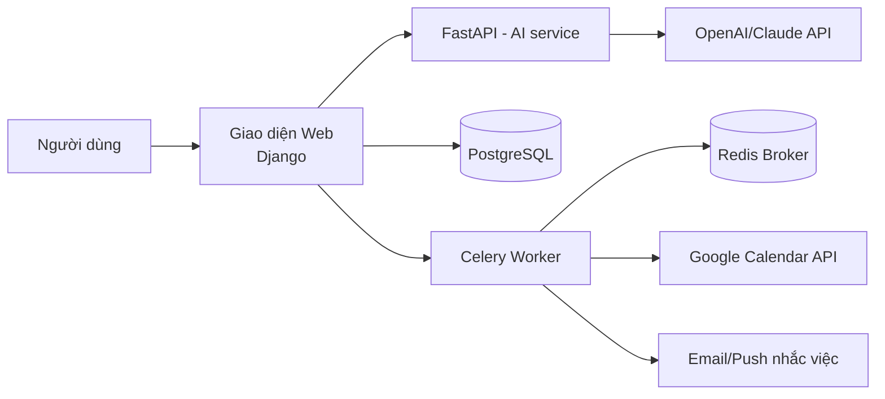

# StudyFlow – Ứng Dụng Lập Kế Hoạch Học Tập Cá Nhân Có AI Gợi Ý Lịch

> Web/App Productivity — Calendar + Optimization + AI Support

## 1. Mục tiêu & Bài toán

Sinh viên học nhiều môn, có deadline, đi làm thêm → dễ bị quá tải lịch hoặc bỏ sót việc quan trọng.

**Mục tiêu sản phẩm:**
- Quản lý lịch học, deadline, tài liệu ôn tập trong một nơi duy nhất.
- Hỗ trợ Pomodoro và nhắc việc, đồng bộ với lịch cá nhân (Google Calendar).
- Cho phép nhập ưu tiên, ước tính thời lượng công việc → hệ thống tự sắp lịch, người dùng vẫn chỉnh sửa được thủ công.
- AI phân tích lịch bận, cảnh báo rủi ro trễ deadline, tóm tắt việc cần làm trong ngày.
- **Trọng tâm là thuật toán lập lịch & trải nghiệm productivity app, không phải chatbot AI.**

**Yêu cầu đầu ra tối thiểu:**
- Sản phẩm web/app hoàn chỉnh, deploy online (có URL truy cập thật).
- Có đăng ký/đăng nhập, phân quyền cơ bản, quản lý user.
- Giao diện UI/UX hoàn chỉnh, không chấp nhận demo notebook / script CLI / prototype chạy localhost.

## 2. Công nghệ sử dụng

| Thành phần | Công nghệ |
|---|---|
| Backend chính + UI | Django (server-rendered)|
| API phụ trợ (nếu cần tách riêng cho AI/mobile) | FastAPI |
| Cơ sở dữ liệu | PostgreSQL |
| Background jobs / nhắc việc / Pomodoro timer / đồng bộ lịch | Redis + Celery |
| AI hỗ trợ (phân tích lịch, cảnh báo deadline) | OpenAI API hoặc Claude API |
| Triển khai | Render / Fly.io / Railway |

> Lưu ý: chọn **một** trong hai (Django hoặc Reflex) làm framework chính để tránh phân mảnh công sức. Django phù hợp nếu quen mô hình MVC + template truyền thống; Reflex phù hợp nếu muốn viết cả frontend bằng Python.

## 3. Kiến trúc tổng quan

## 4. Các module chức năng chính

1. **Auth & User Management**: đăng ký, đăng nhập, quên mật khẩu, hồ sơ cá nhân, phân quyền (user thường/admin).
2. **Quản lý môn học & Deadline**: CRUD môn học, bài tập, kỳ thi, deadline; gắn nhãn ưu tiên và ước tính thời lượng.
3. **Lập lịch tự động (Scheduling Engine)**: thuật toán sắp xếp công việc vào khung giờ trống dựa trên ưu tiên, deadline, thời lượng ước tính; cho phép kéo-thả chỉnh sửa thủ công.
4. **Pomodoro & Nhắc việc**: timer Pomodoro tích hợp, thông báo/nhắc việc qua email hoặc push, chạy nền qua Celery.
5. **Đồng bộ lịch cá nhân**: kết nối Google Calendar (OAuth2), đồng bộ hai chiều.
6. **AI Support**: phân tích mật độ lịch bận, dự đoán/cảnh báo rủi ro trễ deadline, tóm tắt việc cần làm trong ngày/tuần.
7. **Dashboard & Thống kê**: tổng quan tiến độ học tập, biểu đồ thời gian đã dùng, deadline sắp tới.

## 5. Thiết kế dữ liệu (sơ bộ)

- `User` (id, email, password_hash, name, timezone, ...)
- `Course` (id, user_id, name, color, ...)
- `Task` (id, user_id, course_id, title, priority, estimated_duration, deadline, status, ...)
- `ScheduleBlock` (id, task_id, start_time, end_time, is_auto_generated, is_locked)
- `PomodoroSession` (id, user_id, task_id, start_time, duration, completed)
- `CalendarSync` (id, user_id, provider, access_token, refresh_token, last_synced_at)
- `AIInsight` (id, user_id, type, content, created_at) — lưu kết quả cảnh báo/tóm tắt của AI

## 6. Các bước xây dựng (Roadmap)

### Giai đoạn 0 – Chuẩn bị (Tuần 1)
- [ ] Chốt framework chính (Django ).
- [ ] Thiết kế wireframe UI/UX (Figma hoặc phác thảo tay).
- [ ] Thiết kế schema database chi tiết (ERD).
- [ ] Khởi tạo repo, cấu hình môi trường (Docker Compose: app + PostgreSQL + Redis).

### Giai đoạn 1 – Nền tảng cốt lõi (Tuần 2–3)
- [ ] Xây dựng Auth (đăng ký/đăng nhập/phân quyền).
- [ ] CRUD môn học, task, deadline.
- [ ] Giao diện quản lý cơ bản (danh sách, chi tiết, form thêm/sửa).
- [ ] Viết unit test cho các model & API cốt lõi.

### Giai đoạn 2 – Thuật toán lập lịch (Tuần 4–5)
- [ ] Thiết kế thuật toán sắp lịch tự động (ví dụ: greedy theo deadline + ưu tiên, hoặc constraint-based scheduling).
- [ ] Xây dựng giao diện lịch dạng calendar (drag-and-drop chỉnh sửa).
- [ ] Cho phép khóa (lock) block đã chỉnh tay để thuật toán không ghi đè.

### Giai đoạn 3 – Background jobs & Pomodoro (Tuần 6)
- [ ] Cấu hình Celery + Redis cho tác vụ nền.
- [ ] Xây dựng Pomodoro timer + lưu lịch sử phiên làm việc.
- [ ] Hệ thống nhắc việc qua email (và push nếu có thời gian).

### Giai đoạn 4 – Đồng bộ lịch & AI (Tuần 7–8)
- [ ] Tích hợp Google Calendar API (OAuth2, đồng bộ hai chiều).
- [ ] Xây dựng service gọi OpenAI/Claude API (qua FastAPI riêng) để:
  - Phân tích mật độ lịch bận.
  - Cảnh báo rủi ro trễ deadline.
  - Tóm tắt việc cần làm trong ngày.
- [ ] Thiết kế prompt rõ ràng, giới hạn phạm vi AI chỉ hỗ trợ phân tích lịch (không phải chatbot tự do).

### Giai đoạn 5 – Hoàn thiện UI/UX & Dashboard (Tuần 9)
- [ ] Xây dựng dashboard tổng quan (biểu đồ tiến độ, thống kê thời gian).
- [ ] Polish UI/UX: responsive, dark mode (tuỳ chọn), loading state, empty state.
- [ ] Kiểm thử end-to-end (E2E) các luồng chính.

### Giai đoạn 6 – Triển khai & Kiểm thử cuối (Tuần 10)
- [ ] Deploy lên Render/Fly.io/Railway (app + PostgreSQL + Redis).
- [ ] Cấu hình biến môi trường, secrets (API key AI, OAuth credentials).
- [ ] Kiểm thử tải cơ bản, sửa lỗi phát sinh khi deploy.
- [ ] Viết tài liệu hướng dẫn sử dụng + tài liệu kỹ thuật.

## 7. Rủi ro & lưu ý

- **Thuật toán lập lịch là trọng tâm chấm điểm** — cần đầu tư kỹ hơn phần AI chat, tránh sa đà làm chatbot.
- Google Calendar OAuth cần đăng ký project trên Google Cloud Console, có thể mất thời gian xét duyệt nếu public app.
- Giới hạn chi phí gọi API AI (OpenAI/Claude) — nên cache kết quả phân tích, không gọi AI theo real-time liên tục.
- Đảm bảo sản phẩm cuối cùng **có URL deploy thật**, không chỉ chạy localhost.

## 8. Tiêu chí hoàn thành (Definition of Done)

- [ ] Truy cập được qua URL public, có đăng ký/đăng nhập hoạt động.
- [ ] Người dùng tạo được môn học, task, deadline và thấy lịch được tự động sắp xếp.
- [ ] Pomodoro & nhắc việc hoạt động.
- [ ] Đồng bộ được với Google Calendar.
- [ ] AI đưa ra được ít nhất: cảnh báo deadline rủi ro + tóm tắt việc trong ngày.
- [ ] Giao diện UI/UX hoàn chỉnh, không lỗi luồng chính.
